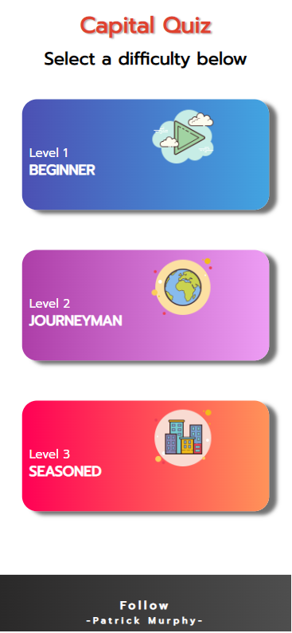
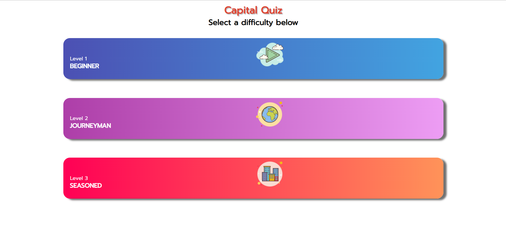
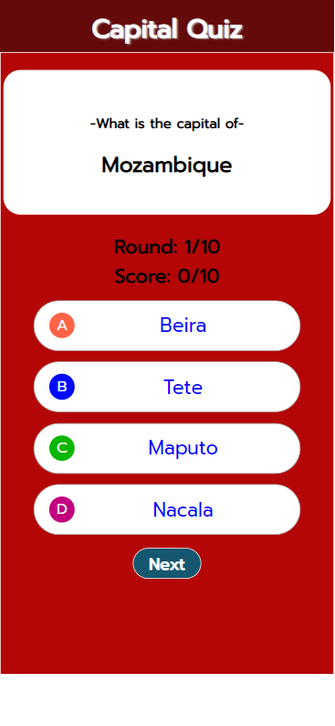
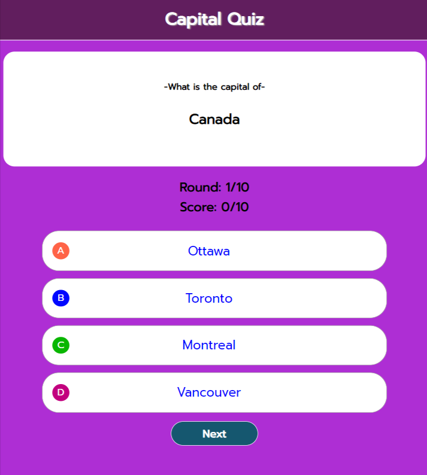
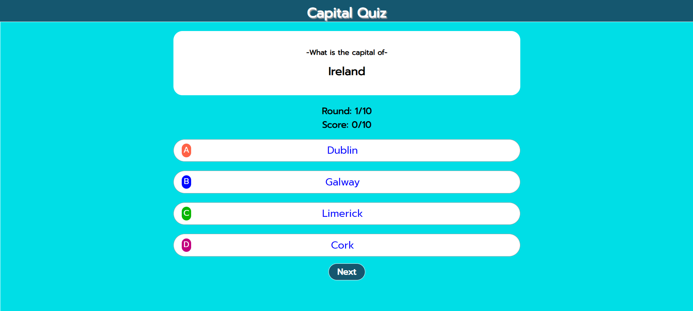
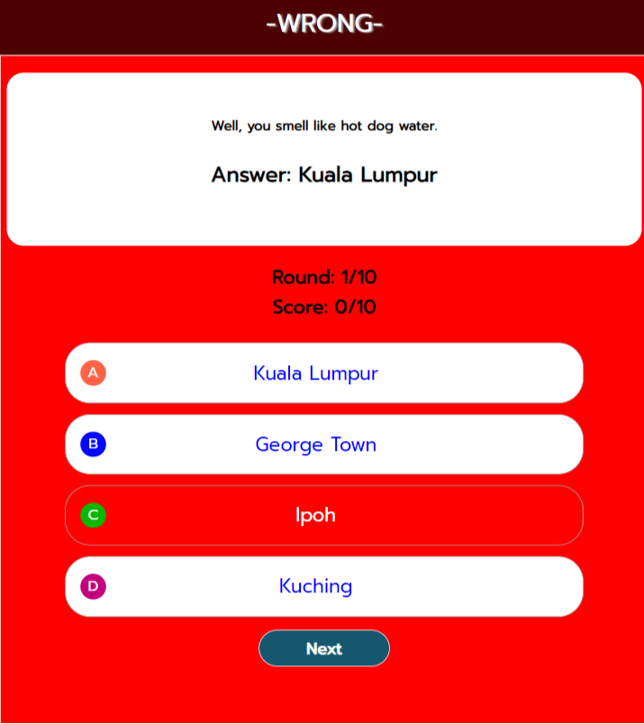
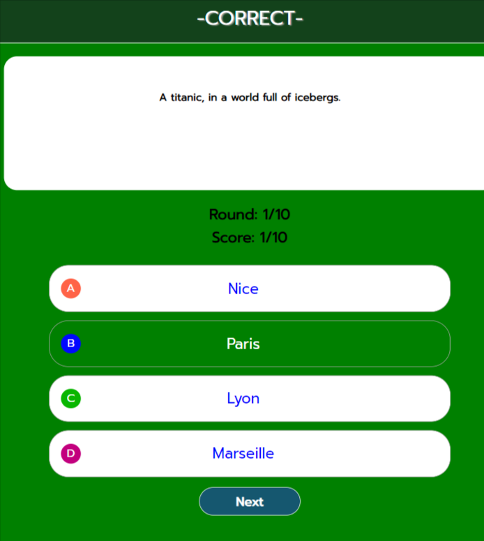
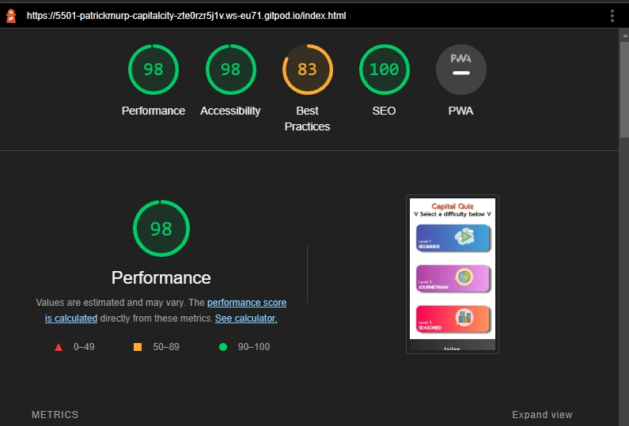

# Capital-City-Quiz

# Capital City Quiz

Welcome to the Capital City Quiz! This is a quiz for those who want to test their capital city knowledge. The quiz has 3 difficulties EASY, MEDIUM, HARD. A few witty comments are thrown at the user along with some interesting World facts. The quiz was designed to be interactive and fun for the user, and having the user want to play again right after finishing a round.

[Capital Quiz Live Website here](https://patrickmurphy22.github.io/Capital-City-Quiz/)

# Table of Contents

____

1. [Overview](#overview)
2. [Features](#features)  
    * [Header](#the-header)
    * [Index Page](#index-page)
    * [Difficulty Selection](#difficulty-selction)
    * [Footer](#footer)
    * [Difficulty Modes](#difficulty-modes)
    * [Quiz Mode](#quiz-mode)
    * [Results Page](#result-page)
    * [Further Features](#further-features)
3. [User Experience](#user-experience)
4. [Technologies](#technologies)
    * [HTML](#html) 
    * [CSS](#css)
    * [JavaScript](#javascript)
5. [Testing](#testing)
    * [Validator](#w3c-validator)
    * [Lighthouse](#lighthouse)
6. [Bugs](#bugs) 
7. [Credits](#credits)
    * [Code](#code)
    * [Images](#images)
8. [Acknowledgement](#acknowledgement)

---
# Overview

The purpose of this project is to demonstrate my abilities in HTML and CSS and JavaScript. 

It's an interactive quiz game that taunts the user after they answer a quiestion correctly or incorrectly  

The purpose of this quiz is to be educational aswell as providing the user with some funny comments and pop culture references.

There is a high likely hood that there will be citys and capitals that the user has never heard of, after a few rounds of this quiz the user will be a geographical genuis.

This Quiz was developed mobile first as per industry standard.

---

## Header

  Shown an all pages of the website.
  
  The header includes:
  
1. The title of the page "CAPITAL QUIZ".
2. When the user starts the quiz, the heading will be given a href via JavaScript to take the user back to the start

## Index Page 

   The Index Page is the only HTML page for this website, my goal was to us DOM manipualtion to control HTML and change the look of the page rather then having numerous HTML pages.

   Content: 
   1. Text that invites the user to select from the 3 difficulties located below
   2. 3 difficulty section ranging from Easy(Beginner), Medium(Journeyman), Hard(Seasoned)
   
### Index Page on Mobile & larger screens

## The Footer

The footer contains 2 social media links and icons, which will take users to my GitHub and LinkedIn.

## Difficulty Modes

As mentioned above the difficulty modes are Easy(Beginner), Medium(Journeyman), Hard(Seasoned).

1. All 3 mode contain 20 random countrys with 4 options each, with one option being the countries Capital.

2. The difficulty of these modes are relative to the European region as the easier mode contains mainly eurpoean coutrys
    and citys, with the harder difficulties being namely African, South American and Asian countries.

3. All 3 modes have different color palettes from light blue for easiest mode, purple for medium mode and red for hard mode.

## Quiz Mode  

There are 4 actions the user can do inside the quiz game mode.

1. Player clicks on Capital City header and gets taken back to difficulty page.

2. The user selects wrong answer.

3. The user selects correct answer.

4. The user clicks next to progress to next round. 

    If user selects Wrong answer,
    1. Header goes red and displays WRONG.
    2. Button an background goes red. 
    3. Correct city will be disaplayed and a cheeky insult will be given by computer.
    

    If user selects Correct answer,
    1. Header goes green and displays Correct.
    2. Button an background goes green. 
    3. the computer will display a cheeky remark to correct guess.
    

The use of insults are as comedic as possible to get a giggle out of the user.
Along with making the user want to get the answer right to rub it in the computers face.

## Results Page

The results page is displayed once the user passes round 10.
The results page contains 3 seperate containers.
1. Disaplys users score out of 10
2. Depending what user had scored a different comment will be dispalyed to them.
3. A fun interesting fact/Pop culture reference is picked and disaplyed at random. 

## Further Features 

Further features for the Quiz are.

After every correct/wrong guess a random comment will be displayed by the computer insulting the player.

### Future Features

In the future I wish to implement a mode that is unlocked when players get 10/10 on the hardest difficulty.
This mode will have players competing against the comuter in the quiz. 
Along with added a time elemnt to the quiz to put more pressure on the user. 

# Technology 

### Technology used 

1. HTML
2. CSS 
2. JavaScript

## HTML 

I used HTML for the bones of this website, at the beginning I had 4 seperate HTML with mostly repetative code. 
Upon learning what JavaScript was fully capable of led me to removing 3 HTML pages.
HTML is used for 14.9% of the website. 

## CSS 

I used CSS to add the flair and colors to the website. 
CSS is used throughout the website providing different colors per difficulty along with adding some linear gradient effects.
CSS is used for 18.6% of the website.

## JavaScript

I used JavaScript for just about everything in the website from altering the text in HTML and creating and 
deleting ID's and Classes to completely hiding DIV's and containers. 
Along with this i used JavaScript to change CSS properties if a users pick was correct or incorrect.

Alot of what was done with JavaScript could of easily been done with HTML and CSS but to become more fluent,
 and competent in JavaScript I believed it practical to control and maniulate the DOM with JavaScript. 
 This also led me to being able to remove so much repetitive HTML code.

JavaScript was used to iteriate through buttons and addEventListeners to wait,
 and see if the user picked the correct answer and what to do and display if the user did so. 
 Along with this and storign global variables which I could then display at a later part of the 
 Quiz I.E displaying the users score at the end then picking what comment to display depending on the user's score.

However there are parts of the code which I believe can reduce when I get a better grasp of JavaScript.
    
JavaScript is used for a majority 66.5%

# Testing

Testing was carried out on HP Laptop, Macbook Pro, Iphone 11 and Samsung s22, Iphone 13 mini iphone 12 and samsung s20.

 ## W3C Validation
 The website raised no issues on W3C CSS or HTML 
 .png)
 

## Lighthouse

 The Website received the following scores on Lighthouse
    Preformance: 98/100
    Accessibility: 98/100
    Best Practices: 83/100 - due to low resolution images on index page.
    SEO: 100/100

 

# Bugs 

During the development I came across 2 bugs.

1. Allowed allowed users to choose more than one option during the quiz mode.
 1. I added remove event listeners to buttons and disable features none of which worked.
 2. I came up with a solution which was to create
 a new function that disabled all buttons on screen.

2. When selecting a correct country or pressing next, Score and Round would increase
by +1 everytime. Second round woul be round 3, round 3 would be round 5 and so on.

 1. The solution was simple yet took me very long to find as I believed it was function 
causing the issue.
 2. The solution was to remove the function being called in another function and add a 
 gameMode function containing all other function and call that instead.

# Credits

## Code

All code was written and implemented by me, however 3 parts of the code written were inspired from from,

1. The code inside generateRandomFunction was inspired by TheWebShala's youtube video on Javascirpt Quiz.

2. Inside the same function there is code which is credited to sebhastian.com, there is comment
above this code to highlight it.

3. Inspiration for the footer code was taken from The Love Running project.

All the above code was reconfigured to be useable for the Capital Quiz.

## Icons

All icons were provided from Font Awesome. 

   
